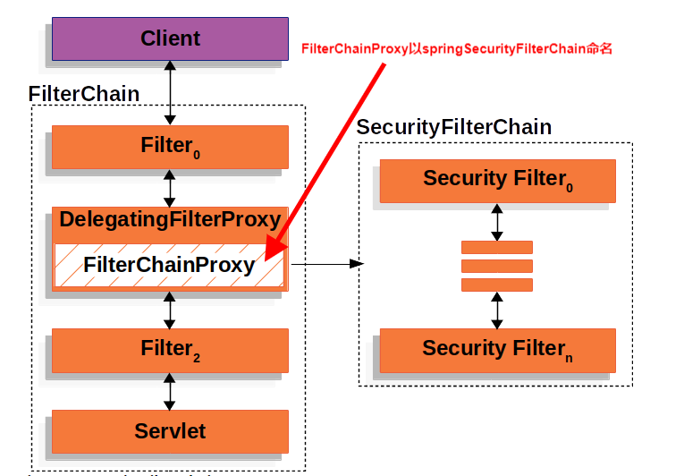
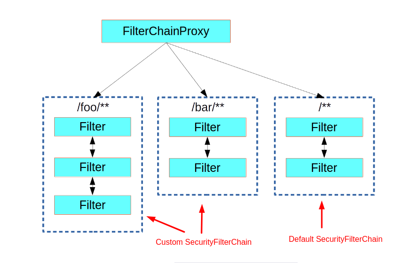
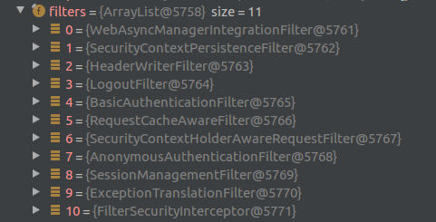
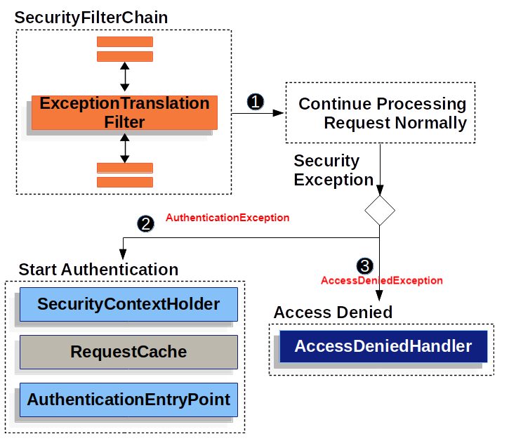
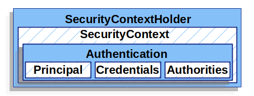
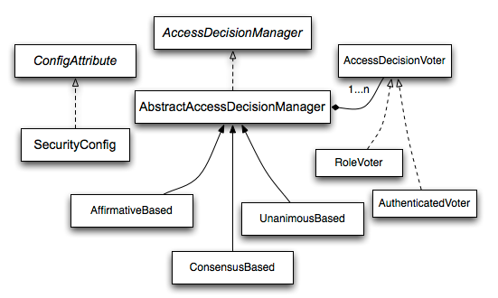

# SpringSecurity - Architecture

Spring Security自定义Servlet Filter --- **FilterChainProxy**作为整个Spring Security的入口, 
通过DelegatingFilterProxy连接Spring Security和Spring Boot, 
通过获取以***springSecurityFilterChain***命名的FilterChainProxy.



## Spring Security Filter

FilterChainProxy作为Spring Security入口, 
在其内部又维护了多个过滤链(**SecurityFilterChain**),
每个过滤链通过对请求进行规则匹配(RequestMatcher), 
然后按顺序执行多个配置的过滤器.



SecurityFilterChain中默认的11个过滤器有以下这些:



### Spring Security 配置

可以通过WebSecurityConfigurerAdapter对Spring Security进行配置.

```java
public abstract class WebSecurityConfigurerAdapter implements
		WebSecurityConfigurer<WebSecurity> {

    /**
     *  通过AuthenticationManagerBuilder对认证进行配置
     *  详见认证的章节
     */
    protected void configure(AuthenticationManagerBuilder auth) throws Exception {
    }

    /**
     *  通过HttpSecurity针对当前这一个SecurityFilterChain进行构建
     *  例如：
     *      - 配置SecurityFilterChain用于哪些请求
     *      - 配置内部的Filter链
     *      - 配置哪些请求需要认证， 哪些不需要
     */
    protected void configure(HttpSecurity http) throws Exception {
    }

    /**
     *  通过WebSecurity对FilterChainProxy进行构建
     */
    public void configure(WebSecurity web) throws Exception {
    }
}
```

## 核心元素

### ExceptionTranslationFilter 

对ExceptionTranslationFilter之后的所有Filter
产生的AccessDeniedException和AuthenticationException进行处理.



### SecurityContextPersistenceFilter && SecurityContext

保存了登录的账户信息, 默认保存在ThreadLocal中, 
在当前请求的处理链中可通过SecurityContextHolder进行访问.



[详见](images/security-context.puml)

### LogoutFilter

用户登出, 通过**LogoutHandler**实例对相关的数据进行清理,
成功清理完成后调用**LogoutSuccessHandler**

### 认证(Authentication)相关的Filter

- Authentication, 描述登录的账户信息以及权限信息, 
会被保存到SecurityContext中
- AuthenticationManager, 对账户信息进行认证处理, 
默认的实现为ProviderManager


AuthenticationManager分为两种: 全局范围和当前处理链范围;
处理优先级: 当前处理链范围 --> 全局范围 --> 认证失败

参考**BasicAuthenticationFilter**和**DaoAuthenticationProvider**

### 鉴权(Authorization)相关的Filter

**FilterSecurityInterceptor**对在HttpSecurity中预先配置好权限的请求url的进行鉴权.
通过**AccessDecisionManager**遍历AccessDecisionVoter对请求进行鉴权(Authorization)处理



## Reference

- [Spring Security Architecture](https://spring.io/guides/topicals/spring-security-architecture)
- [Spring Security for Spring Boot Integration Tests](https://www.baeldung.com/spring-security-integration-tests)